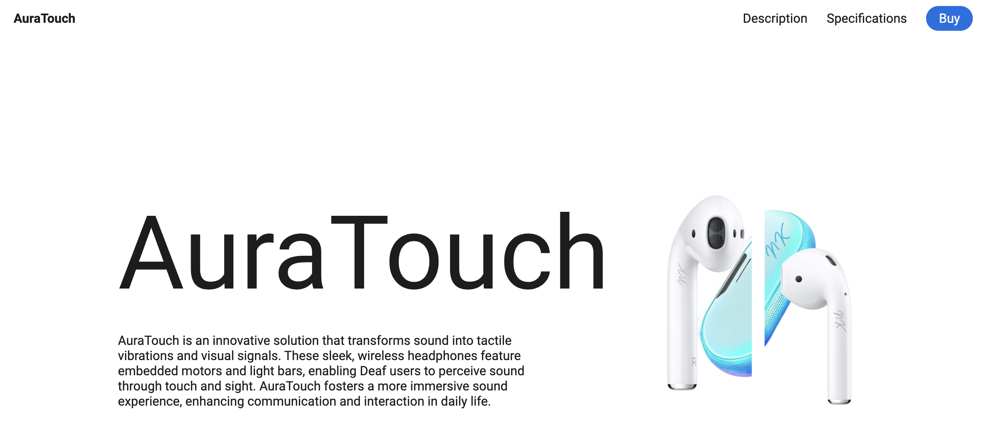

# AuraTouch-Designer



## Overview

**AuraTouch** is an innovative UX/UI solution designed to transform sound into tactile vibrations and visual signals. These sleek, wireless headphones are embedded with motors and light bars, enabling Deaf users to perceive sound through touch and sight. AuraTouch enhances communication and interaction in daily life by providing a more immersive sound experience.

## Features

- **Sound-to-Touch Conversion**: Converts sound into tactile vibrations.
- **Visual Signals**: Uses embedded light bars to display sound visually.
- **Wireless Design**: Sleek and wireless for ease of use.
- **Long Battery Life**: Over 48 hours of battery life with the charging case and up to 10 hours on a single charge.
- **Quick Charging**: 10 minutes of charging provides up to 5 hours of audio.

## Table of Contents

- [Installation](#installation)
- [Usage](#usage)
- [Project Structure](#project-structure)
- [Contributing](#contributing)
- [License](#license)

## Installation

To set up the project locally, follow these steps:

1. **Clone the repository**:
   ```sh
   git clone https://github.com/yourusername/AuraTouch-Designer.git
   
2. **Navigate to the project directory**:
   ```sh
   cd AuraTouch-Designer
   ```
3. **Open the project**:
   Open `index.html` in your browser to view the AuraTouch UI.

## Usage

- **Navigate the UI**: 
  - Use the navigation menu to explore different sections such as "Description" and "Specifications".
  - Scroll down to see the product details and specifications.

- **Interactive Elements**: 
  - Click on the "Buy" button for purchasing options (link not implemented in the example).
  - Hover over the product images for additional interaction.

## Project Structure

```
AuraTouch-Designer/
│
├── assets/
│   ├── css/
│   │   └── styles.css
│   ├── icons/
│   │   ├── bx-chevron-down.svg
│   │   └── bx-mouse.svg
│   ├── img/
│   │   ├── airpod1.png
│   │   ├── airpod2.png
│   │   └── airpods.png
│   └── js/
│       └── main.js
│
├── favicon.ico
├── index.html
└── README.md
```

### File Descriptions

- **index.html**: The main HTML file containing the structure of the AuraTouch UI.
- **assets/css/styles.css**: Stylesheet for the project.
- **assets/js/main.js**: JavaScript for interactive elements.
- **assets/img/**: Contains images used in the project.
- **assets/icons/**: Contains icons used in the navigation and other UI elements.

## Contributing

We welcome contributions! Please follow these steps to contribute:

1. **Fork the repository**.
2. **Create a new branch**:
   ```sh
   git checkout -b feature/your-feature-name
   ```
3. **Commit your changes**:
   ```sh
   git commit -m 'Add your feature'
   ```
4. **Push to the branch**:
   ```sh
   git push origin feature/your-feature-name
   ```
5. **Create a pull request**.

## Authors

- **Worachat W, Dev.** - *Data Science, Engineering & Full Stack Dev. 2024*

## License

This project is licensed under the MIT License. See the [LICENSE](LICENSE) file for more details.


## Acknowledgements

Inspiration and Credits: This project is inspired by the concept of accessible sound experiences for Deaf users. We acknowledge the work done by bedimcode on a similar website design for headphones, which can be found on 

My Product Landing Page: https://worachat-dev.github.io/AuraTouch-Designer-Landing-Page-dev

Special thanks to the developers and designers who contributed to the AuraTouch project.

## Contact

For any inquiries or issues, please contact me.!

---

